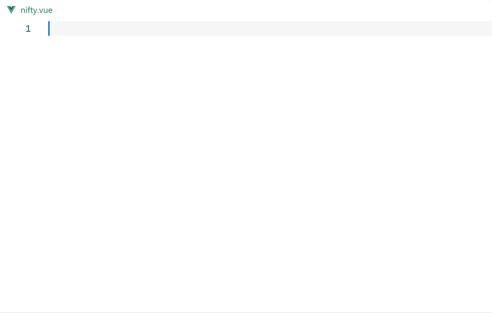
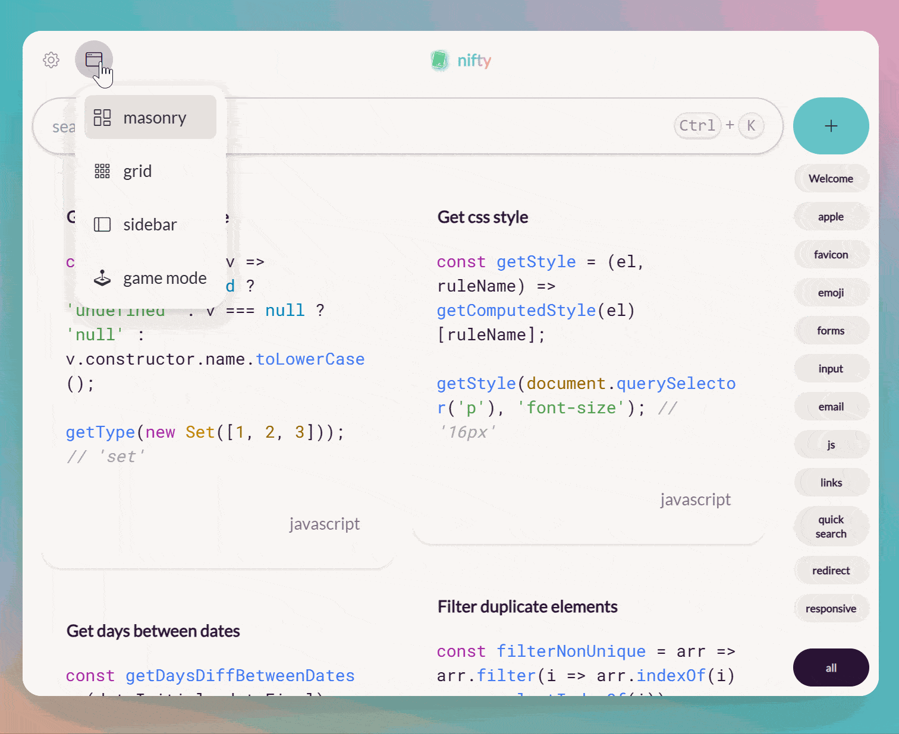

<b style="color: #66cc99; font-size: 1.6rem">nifty</b>

🧑‍🎓🧑‍💻🧝🦸🧑‍🚀

<b>Capture and Reuse</b> 

<a href="" style="color: #000; cursor: pointer; border: 3px solid;
  padding: 0.25em 0.5em; box-shadow: 1px 1px 0px 0px, 2px 2px 0px 0px, 3px 3px 0px 0px, 4px 4px 0px 0px, 5px 5px 0px 0px;">
Video Preview
</a>&nbsp;&nbsp;|&nbsp;&nbsp;<a href="" style="color: #66cc99; cursor: pointer; border: 3px solid;
  padding: 0.25em 0.5em; box-shadow: 1px 1px 0px 0px, 2px 2px 0px 0px, 3px 3px 0px 0px, 4px 4px 0px 0px, 5px 5px 0px 0px;">
  Download Now!
</a>

## Features

### 🧑‍💻 Write Code Seamlessly

### 🎨 Customizable Themes

### 🪟 Various Views

### 🔖 tag driven

Folderless design, utilizing tags for indexing, reducing cognitive load

### coming soon

- ➕ Quick Add: Quick Add snippets with keyboard shortcuts.
- 🎴 Share snippet shot: Export snippets as beautiful image.
- 🔄️ Synchronise Snippets: Synchronise code snippets anywhere, at any time, on any device.
- 🏠 Snippet marketplace: Share snippets with the world.
